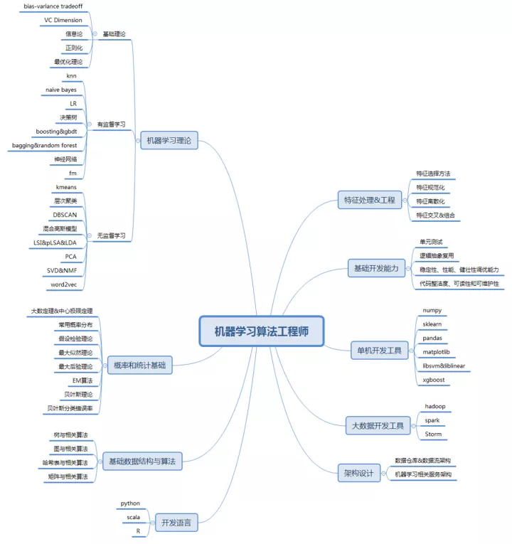

作者 | 张相於

责编 | 何永灿

成为一名合格的开发工程师不是一件简单的事情，需要掌握从开发到调试到优化等一系列能力，这些能力中的每一项掌握起来都需要足够的努力和经验。

而要成为一名合格的机器学习算法工程师（以下简称算法工程师）更是难上加难，因为在掌握工程师的通用技能以外，还需要掌握一张不算小的机器学习算法知识网络。

下面我们就将成为一名合格的算法工程师所需的技能进行拆分，一起来看一下究竟需要掌握哪些技能才能算是一名合格的算法工程师。

> ​                                                      图1 机器学习算法工程师技能树

**基础开发能力**

所谓算法工程师，首先需要是一名工程师，那么就要掌握所有开发工程师都需要掌握的一些能力。有些同学对于这一点存在一些误解，认为所谓算法工程师就只需要思考和设计算法，不用在乎这些算法如何实现，而且会有人帮你来实现你想出来的算法方案。这种思想是错误的，在大多数企业的大多数职位中，算法工程师需要负责从算法设计到算法实现再到算法上线这一个全流程的工作。

笔者曾经见过一些企业实行过算法设计与算法实现相分离的组织架构，但是在这种架构下，说不清楚谁该为算法效果负责，算法设计者和算法开发者都有一肚子的苦水，具体原因不在本文的讨论范畴中，但希望大家记住的是，基础的开发技能是所有算法工程师都需要掌握的。

基础开发所涉及到的技能非常的多，在这里只挑选了两个比较重要的点来做阐述。

**单元测试**

在企业应用中，一个问题的完整解决方案通常包括很多的流程，这其中每个环节都需要反复迭代优化调试，如何能够将复杂任务进行模块划分，并且保证整体流程的正确性呢？最实用的方法就是单元测试。单元测试并不只是简单的一种测试技能，它首先是一种设计能力。并不是每份代码都可以做单元测试，能做单元测试的前提是代码首先是可以划分为多个单元——也就是模块的。在把项目拆解成可独立开发和测试的模块之后，再加上对每个模块的独立的、可重复的单元测试，就可以保证每个模块的正确性，如果每个模块的正确性都可以保证，那么整体流程的正确性就可以得到保证。

对于算法开发这种流程变动频繁的开发活动来讲，做好模块设计和单元测试是不给自己和他人挖坑的重要保证。也是能让自己放心地对代码做各种改动优化的重要前提。

**逻辑抽象复用**

逻辑的抽象复用可以说是所有软件开发活动中最为重要的一条原则，衡量一个程序员代码水平的重要原则之一就是看他代码中重复代码和相似代码的比例。大量重复代码或相似代码背后反映的是工程师思维的懒惰，因为他觉得复制粘贴或者直接照着抄是最省事的做法。这样做不仅看上去非常的丑陋，而且也非常容易出错，更不用提维护起来的难度。

算法开发的项目中经常会有很多类似逻辑的出现，例如对多个特征使用类似的处理方法，还有原始数据ETL中的很多类似处理方法。如果不对重复逻辑做好抽象，代码看上去全是一行行的重复代码，无论是阅读起来还是维护起来都会非常麻烦。

**概率和统计基础**

概率和统计可以说是机器学习领域的基石之一，从某个角度来看，机器学习可以看做是建立在概率思维之上的一种对不确定世界的系统性思考和认知方式。学会用概率的视角看待问题，用概率的语言描述问题，是深入理解和熟练运用机器学习技术的最重要基础之一。

概率论内容很多，但都是以具体的一个个分布为具体表现载体体现出来的，所以学好常用的概率分布及其各种性质对于学好概率非常重要。对于离散数据，伯努利分布、二项分布、多项分布、Beta分布、狄里克莱分布以及泊松分布都是需要理解掌握的内容；对于离线数据，高斯分布和指数分布族是比较重要的分布。这些分布贯穿着机器学习的各种模型之中，也存在于互联网和真实世界的各种数据之中，理解了数据的分布，才能知道该对它们做什么样的处理。

此外，假设检验的相关理论也需要掌握。在这个所谓的大数据时代，最能骗人的大概就是数据了，掌握了假设检验和置信区间等相关理论，才能具备分辨数据结论真伪的能力。例如两组数据是否真的存在差异，上线一个策略之后指标是否真的有提升等等。这种问题在实际工作中非常常见，不掌握相关能力的话相当于就是大数据时代的睁眼瞎。

在统计方面，一些常用的参数估计方法也需要掌握，典型的如最大似然估计、最大后验估计、EM算法等。这些理论和最优化理论一样，都是可以应用于所有模型的理论，是基础中的基础。

**机器学习理论**

虽然现在开箱即用的开源工具包越来越多，但并不意味着算法工程师就可以忽略机器学习基础理论的学习和掌握。这样做主要有两方面的意义：

- 掌握理论才能对各种工具、技巧灵活应用，而不是只会照搬套用。只有在这个基础上才能够真正具备搭建一套机器学习系统的能力，并对其进行持续优化。否则只能算是机器学习搬砖工人，算不得合格的工程师。出了问题也不会解决，更谈不上对系统做优化。
- 学习机器学习的基础理论的目的不仅仅是学会如何构建机器学习系统，更重要的是，这些基础理论里面体现的是一套思想和思维模式，其内涵包括概率性思维、矩阵化思维、最优化思维等多个子领域，这一套思维模式对于在当今这个大数据时代做数据的处理、分析和建模是非常有帮助的。如果你脑子里没有这套思维，面对大数据环境还在用老一套非概率的、标量式的思维去思考问题，那么思考的效率和深度都会非常受限。

机器学习的理论内涵和外延非常之广，绝非一篇文章可以穷尽，所以在这里我列举了一些比较核心，同时对于实际工作比较有帮助的内容进行介绍，大家可在掌握了这些基础内容之后，再不断探索学习。

**基础理论**

所谓基础理论，指的是不涉及任何具体模型，而只关注“学习”这件事本身的一些理论。以下是一些比较有用的基础概念：

- **VC维。**VC维是一个很有趣的概念，它的主体是一类函数，描述的是这类函数能够把多少个样本的所有组合都划分开来。VC维的意义在哪里呢？它在于当你选定了一个模型以及它对应的特征之后，你是大概可以知道这组模型和特征的选择能够对多大的数据集进行分类的。此外，一类函数的VC维的大小，还可以反应出这类函数过拟合的可能性。
- **信息论。**从某种角度来讲，机器学习和信息论是同一个问题的两个侧面，机器学习模型的优化过程同时也可以看作是最小化数据集中信息量的过程。对信息论中基本概念的了解，对于机器学习理论的学习是大有裨益的。例如决策树中用来做分裂决策依据的信息增益，衡量数据信息量的信息熵等等，这些概念的理解对于机器学习问题神本的理解都很有帮助。这部分内容可参考《Elements of Information Theory》这本书。
- **正则化和bias-variance tradeoff。**如果说现阶段我国的主要矛盾是“人民日益增长的美好生活需要和不平衡不充分的发展之间的矛盾”，那么机器学习中的主要矛盾就是模型要尽量拟合数据和模型不能过度拟合数据之间的矛盾。而化解这一矛盾的核心技术之一就是正则化。正则化的具体方法不在此讨论，但需要理解的，是各种正则化方法背后透露出的思想：bias-variance tradoff。在不同利益点之间的平衡与取舍是各种算法之间的重要差异，理解这一点对于理解不同算法之间的核心差异有着非常重要的作用。
- **最优化理论。**绝大多数机器学习问题的解决，都可以划分为两个阶段：建模和优化。所谓建模就是后面我们会提到的各种用模型来描述问题的方法，而优化就是建模完成之后求得模型的最优参数的过程。机器学习中常用的模型有很多，但背后用到的优化方法却并没有那么多。换句话说，很多模型都是用的同一套优化方法，而同一个优化方法也可以用来优化很多不同模型。对各种常用优化方法的和思想有所有了解非常有必要，对于理解模型训练的过程，以及解释各种情况下模型训练的效果都很有帮助。这里面包括最大似然、最大后验、梯度下降、拟牛顿法、L-BFGS等。

机器学习的基础理论还有很多，可以先从上面的概念学起，把它们当做学习的起点，在学习过程中还会遇到其他需要学习的内容，就像一张网络慢慢铺开一样，不断积累自己的知识。这方面基础理论的学习，除了Andrew Ng的著名课程以外，《Learning from Data》这门公开课也非常值得大家学习，这门课没有任何背景要求，讲授的内容是在所有模型之下的基础中的基础，非常地靠近机器学习的内核本质。这门课的中文版本叫做《机器学习基石》，也可以在网上找到，其讲授者是上面英文版本讲授者的学生。

**有监督学习**

在了解了机器学习的基本概念之后，就可以进入到一些具体模型的学习中了。在目前的工业实践中，有监督学习的应用面仍然是最广泛的，这是因为我们现实中遇到的很多问题都是希望对某个事物的某个属性做出预测，而这些问题通过合理的抽象和变换，都可以转化为有监督学习的问题。

在学习复杂模型之前，我建议大家都先学习几个最简单的模型，典型的如朴素贝叶斯。朴素贝叶斯有很强的假设，这个假设很多问题都不满足，模型结构也很简单，所以其优化效果并不是最好的。但也正是由于其简单的形式，非常利于学习者深入理解整个模型在建模和优化过程中的每一步，这对于搞清楚机器学习是怎么一回事情是非常有用的。同时，朴素贝叶斯的模型形式通过一番巧妙的变换之后，可以得到和逻辑回归形式上非常统一的结果，这无疑提供了对逻辑回归另外一个角度的解释，对于更加深刻理解逻辑回归这一最常用模型有着非常重要的作用。

在掌握了机器学习模型的基础流程之后，需要学习两种最基础的模型形式：线性模型和树形模型，分别对应着线性回归/逻辑回归和决策回归/分类树。现在常用的模型，无论是浅层模型还是深度学习的深层模型，都是基于这两种基础模型形式变幻而来。而学习这两种模型的时候需要仔细思考的问题是：这两种模型的本质差异是什么？为什么需要有这两种模型？他们在训练和预测的精度、效率、复杂度等方面有什么差异？了解清楚这些本质的差异之后，才可以做到根据问题和数据的具体情况对模型自如运用。

在掌握了线性模型和树形模型这两种基础形式之后，下一步需要掌握的是这两种基础模型的复杂形式。其中线性模型的复杂形式就是多层线性模型，也就是神经网络。树模型的复杂形式包括以GDBT为代表的boosting组合，以及以随机森林为代表的bagging组合。这两种组合模型的意义不仅在于模型本身，boosting和bagging这两种组合思想本身也非常值得学习和理解，这代表了两种一般性的强化方法：boosting的思想是精益求精，不断在之前的基础上继续优化；而bagging的思想是“三个臭裨将顶一个诸葛亮”，是通过多个弱分类器的组合来得到一个强分类器。这两种组合方法各有优劣，但都是在日常工作中可以借鉴的思想。例如在推荐系统中所我们经常会使用多个维度的数据做召回源，从某个角度来看就是一种bagging的思想：每个单独召回源并不能给出最好表现，但是多个召回源组合之后，就可以得到比每个单独召回源都要好的结果。所以说思想比模型本身更重要。

**无监督学习**

有监督学习虽然目前占了机器学习应用的大多数场景，但是无监督学习无论从数据规模还是作用上来讲也都非常的重要。无监督学习的一大类内容是在做聚类，做聚类的意义通常可以分为两类：一类是将聚类结果本身当做最终的目标，另一类是将聚类的结果再作为特征用到有监督学习中。但这两种意义并不是和某种聚类方法具体绑定，而只是聚类之后结果的不同使用方式，这需要在工作中不断学习、积累和思考。而在入门学习阶段需要掌握的，是不同聚类算法的核心差异在哪里。例如最常用的聚类方法中，kmeans和DBSCAN分别适合处理什么样的问题？高斯混合模型有着什么样的假设？LDA中文档、主题和词之间是什么关系？这些模型最好能够放到一起来学习，从而掌握它们之间的联系和差异，而不是把他们当做一个个孤立的东西来看待。

除了聚类以外，近年来兴起的嵌入表示（embedding representation）也是无监督学习的一种重要方法。这种方法和聚类的差异在于，聚类的方法是使用已有特征对数据进行划分，而嵌入表示则是创造新的特征，这种新的特征是对样本的一种全新的表示方式。这种新的表示方法提供了对数据全新的观察视角，这种视角提供了数据处理的全新的可能性。此外，这种做法虽然是从NLP领域中兴起，但却具有很强的普适性，可用来处理多种多样的数据，都可以得到不错的结果，所以现在已经成为一种必备的技能。

机器学习理论方面的学习可以从《An Introduction to Statistical Learning with Application in R》开始，这本书对一些常用模型和理论基础提供了很好的讲解，同时也有适量的习题用来巩固所学知识。进阶学习可使用上面这本书的升级版《Elements of Statistical Learning》和著名的《Pattern Recognition and Machine Learning》。

**开发语言和开发工具**

掌握了足够的理论知识，还需要足够的工具来将这些理论落地，这部分我们介绍一些常用的语言和工具。

**开发语言**

近年来Python可以说是数据科学和算法领域最火的语言，主要原因是它使用门槛低，上手容易，同时具有着完备的工具生态圈，同时各种平台对其支持也比较好。所以Python方面我就不再赘述。但是在学习Python以外，我建议大家可以再学习一下R语言，主要原因有以下几点：

- **R语言具有最完备的统计学工具链。**我们在上面介绍了概率和统计的重要性，R语言在这方面提供的支持是最全面的，日常的一些统计方面的需求，用R来做可能要比用Python来做还要更快。Python的统计科学工具虽然也在不断完善，但是R仍然是统计科学最大最活跃的社区。
- **向量化、矩阵化和表格化思维的培养。**R中的所有数据类型都是向量化的，一个整形的变量本质上是一个长度为一的一维向量。在此基础上R语言构建了高效的矩阵和（DataFrame）数据类型，并且在上面支持了非常复杂而又直观的操作方法。这套数据类型和思考方式也在被很多更现代化的语言和工具所采纳，例如Numpy中的ndarray，以及Spark最新版本中引入的DataFrame，可以说都是直接或间接从R语言得到的灵感，定义在上面的数据操作也和R中对DataFrame和向量的操作如出一辙。就像学编程都要从C语言学起一样，学数据科学和算法开发我建议大家都学一下R，学的既是它的语言本身，更是它的内涵思想，对大家掌握和理解现代化工具都大有裨益。

除了R以外，Scala也是一门值得学习的语言。原因在于它是目前将面向对象和函数式两种编程范式结合得比较好的一种语言，因为它不强求你一定要用函数式去写代码，同时还能够在能够利用函数式的地方给予了足够的支持。这使得它的使用门槛并不高，但是随着经验和知识的不断积累，你可以用它写出越来越高级、优雅的代码。

**开发工具**

开发工具方面，Python系的工具无疑是实用性最高的，具体来说，Numpy、Scipy、sklearn、pandas、Matplotlib组成的套件可以满足单机上绝大多数的分析和训练工作。但是在模型训练方面，有一些更加专注的工具可以给出更好的训练精度和性能，典型的如LibSVM、Liblinear、XGBoost等。

大数据工具方面，目前离线计算的主流工具仍然是Hadoop和Spark，实时计算方面Spark Streaming和Storm也是比较主流的选择。近年来兴起的新平台也比较多，例如Flink和Tensorflow都是值得关注的。值得一提的是，对于Hadoop和Spark的掌握，不仅要掌握其编码技术，同时还要对其运行原理有一定理解，例如，Map-Reduce的流程在Hadoop上是如何实现的，Spark上什么操作比较耗时，aggregateByKey和groupByKey在运行原理上有什么差异，等等。只有掌握了这些，才能对这些大数据平台运用自如，否则很容易出现程序耗时过长、跑不动、内存爆掉等等问题。

**架构设计**

最后我们花一些篇幅来谈一下机器学习系统的架构设计。所谓机器学习系统的架构，指的是一套能够支持机器学习训练、预测、服务稳定高效运行的整体系统以及他们之间的关系。

在业务规模和复杂度发展到一定程度的时候，机器学习一定会走向系统化、平台化这个方向。这个时候就需要根据业务特点以及机器学习本身的特点来设计一套整体架构，这里面包括上游数据仓库和数据流的架构设计，以及模型训练的架构，还有线上服务的架构等等。这一套架构的学习就不像前面的内容那么简单了，没有太多现成教材可以学习，更多的是在大量实践的基础上进行抽象总结，对当前系统不断进行演化和改进。但这无疑是算法工程师职业道路上最值得为之奋斗的工作。在这里能给的建议就是多实践，多总结，多抽象，多迭代。

**机器学习算法工程师领域现状**

现在可以说是机器学习算法工程师最好的时代，各行各业对这类人才的需求都非常旺盛。典型的包括以下一些细分行业：

- **推荐系统。**推荐系统解决的是海量数据场景下信息高效匹配分发的问题，在这个过程中，无论是候选集召回，还是结果排序，以及用户画像等等方面，机器学习都起着重要的作用。
- **广告系统。**广告系统和推荐系统有很多类似的地方，但也有着很显著的差异，需要在考虑平台和用户之外同时考虑广告主的利益，两方变成了三方，使得一些问题变复杂了很多。它在对机器学习的利用方面也和推荐类似。
- **搜索系统。**搜索系统的很多基础建设和上层排序方面都大量使用了机器学习技术，而且在很多网站和App中，搜索都是非常重要的流量入口，机器学习对搜索系统的优化会直接影响到整个网站的效率。
- **风控系统。**风控，尤其是互联网金融风控是近年来兴起的机器学习的又一重要战场。不夸张地说，运用机器学习的能力可以很大程度上决定一家互联网金融企业的风控能力，而风控能力本身又是这些企业业务保障的核心竞争力，这其中的关系大家可以感受一下。

但是所谓“工资越高，责任越大”，企业对于算法工程师的要求也在逐渐提高。整体来说，一名高级别的算法工程师应该能够处理“数据获取→数据分析→模型训练调优→模型上线”这一完整流程，并对流程中的各种环节做不断优化。一名工程师入门时可能会从上面流程中的某一个环节做起，不断扩大自己的能力范围。

除了上面列出的领域以外，还有很多传统行业也在不断挖掘机器学习解决传统问题的能力，行业的未来可谓潜力巨大。

**参考文献 **

朴素贝叶斯和逻辑回归之间的关系可参考：http://www.cs.cmu.edu/~tom/mlbook/NBayesLogReg.pdf 

《learning_from_data》 

《An Introduction to Statistical Learning with Application in R》: 

英文版下载：http://www-bcf.usc.edu/~gareth/ISL/； 

中译版名为《统计学习导论》，前七章的视频课程可见：http://edu.csdn.net/huiyiCourse/series_detail/13。 

《Elements of Statistical Learning》 

《Elements of Information Theory》

> **作者简介：** 张相於，二手交易平台转转推荐算法部负责人，算法架构师，负责转转的推荐系统以及其他算法相关工作，邮箱：zhangxy@live.com。
>
> 责编：何永灿 

转载自：[https://mp.weixin.qq.com/s?__biz=MzAwNDI4ODcxNA==&mid=2652246018&idx=1&sn=d1f12468f3533726a7b4e1d06568608a&chksm=80cc89a7b7bb00b1a2742c2bf713c15881f9fdbdcb8f6c0c3d443617a0a30a00596c3523e961&scene=21#wechat_redirect](https://mp.weixin.qq.com/s?__biz=MzAwNDI4ODcxNA==&mid=2652246018&idx=1&sn=d1f12468f3533726a7b4e1d06568608a&chksm=80cc89a7b7bb00b1a2742c2bf713c15881f9fdbdcb8f6c0c3d443617a0a30a00596c3523e961&scene=21#wechat_redirect)

